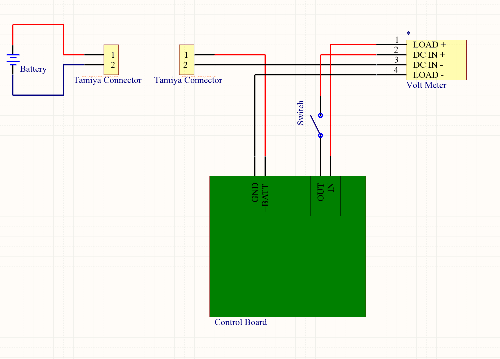
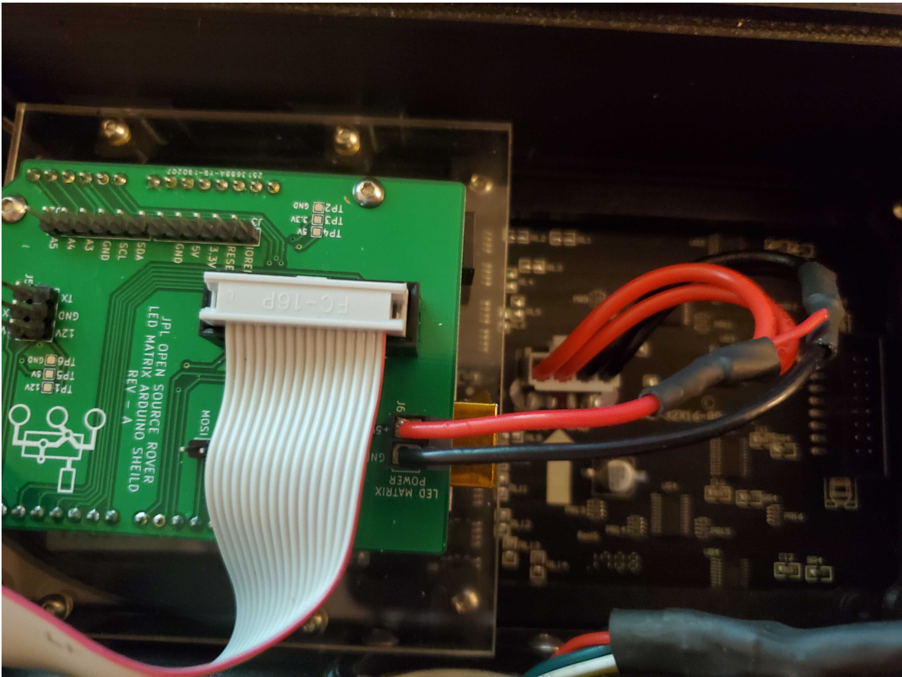
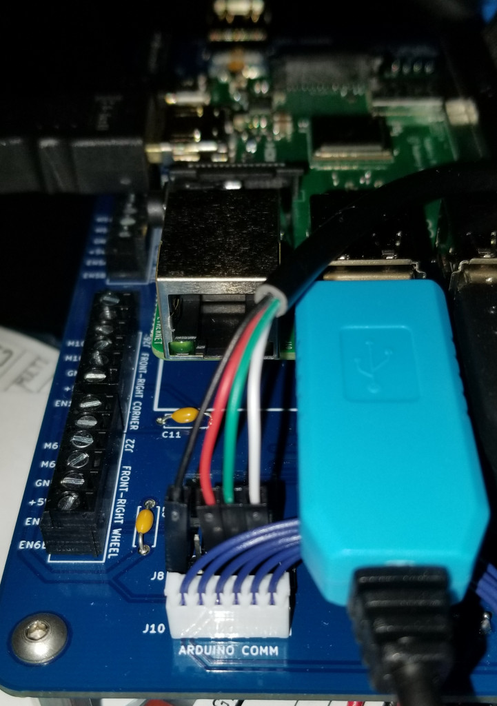
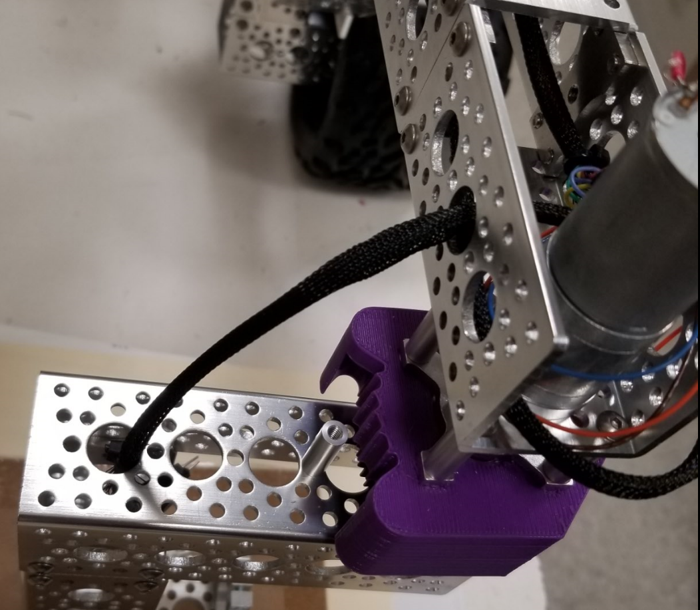
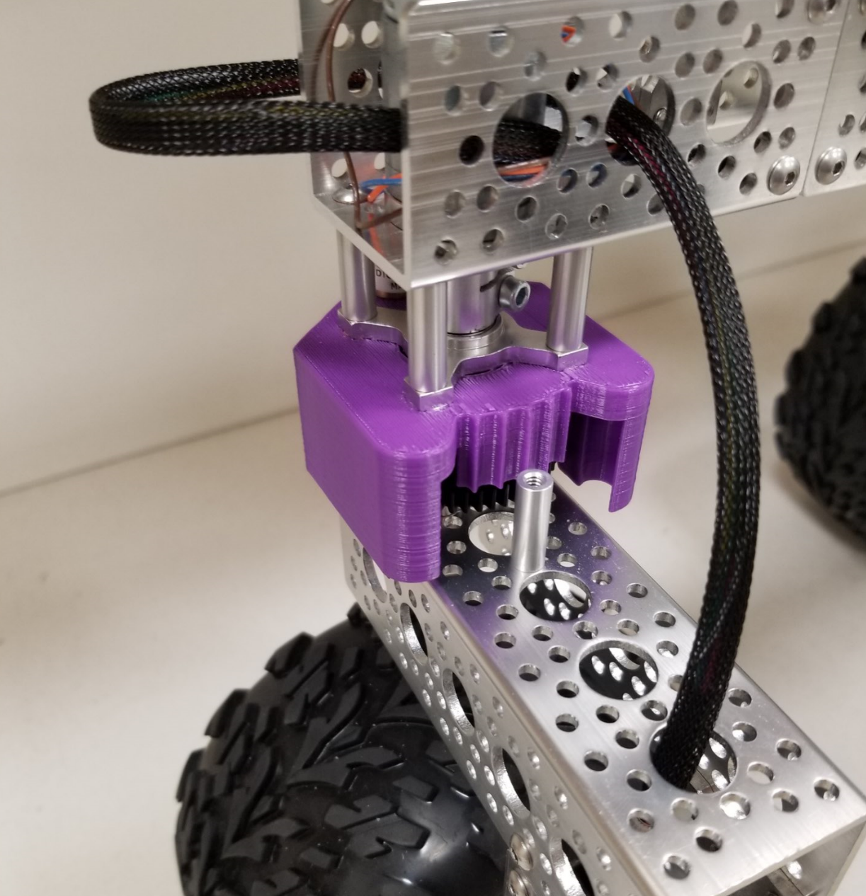
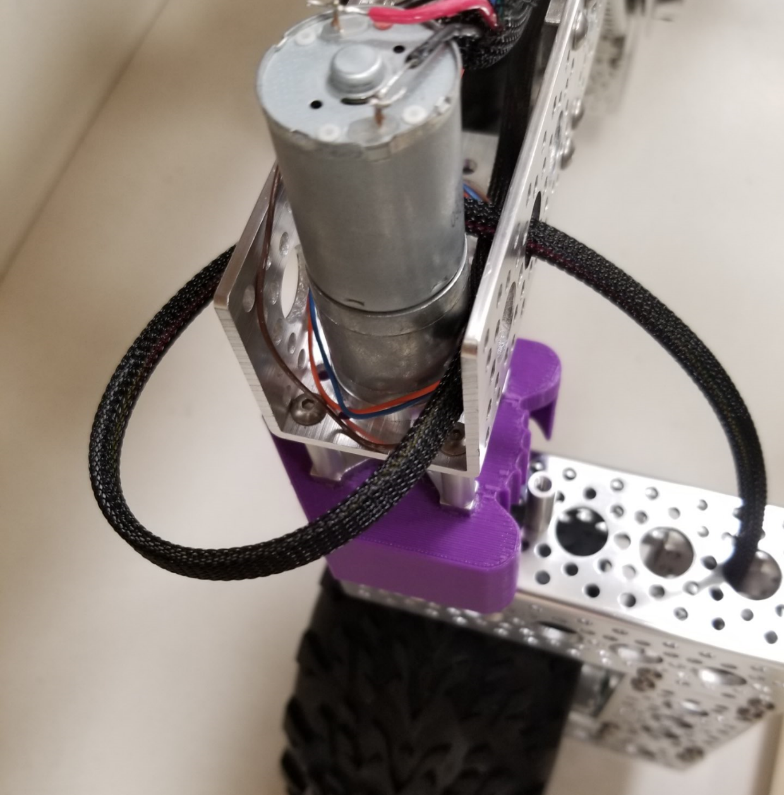
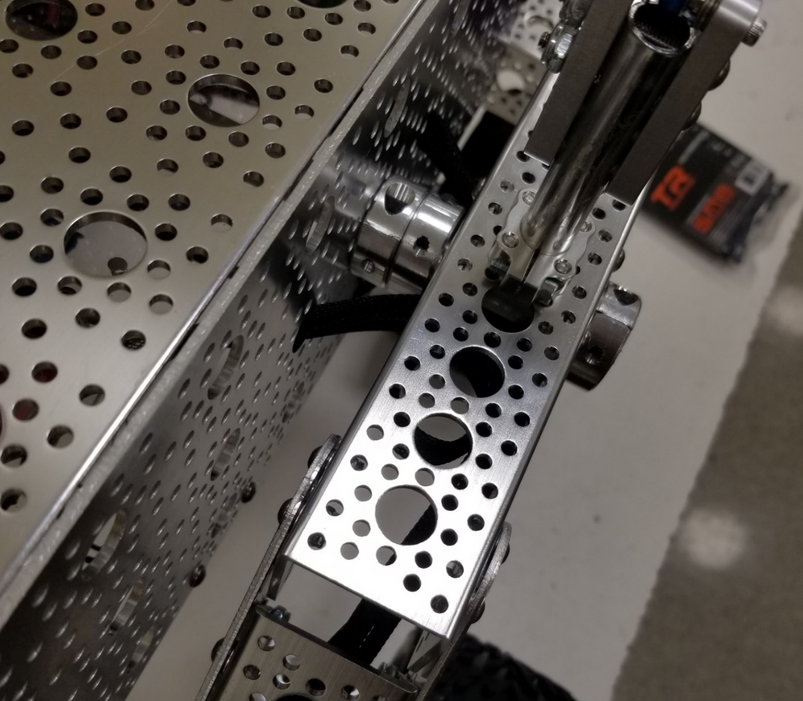
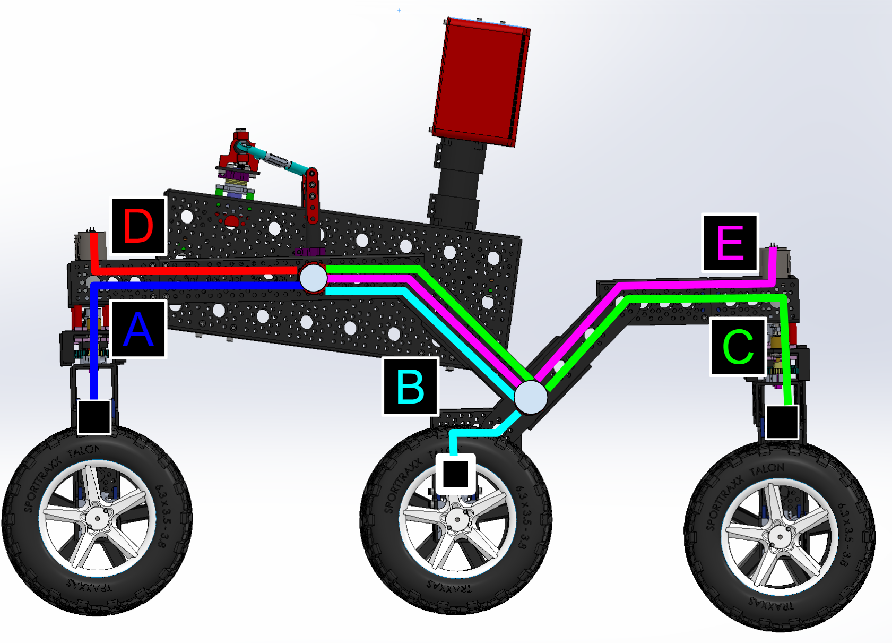
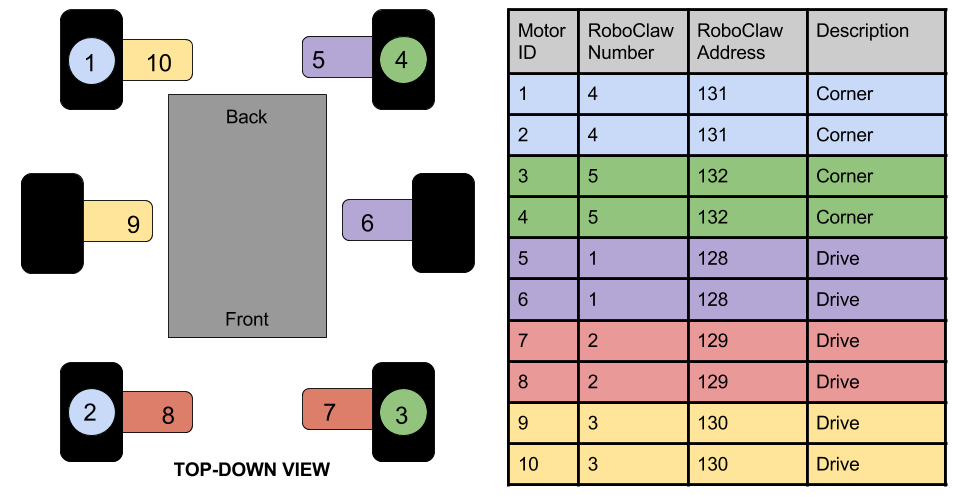
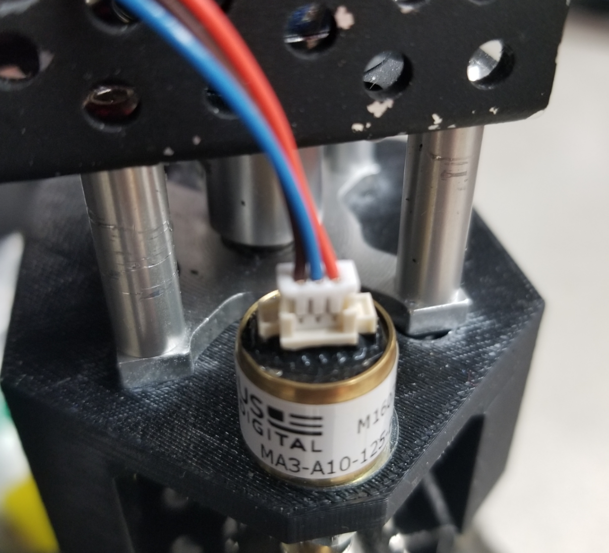

# Open Source Rover: Electrical Assembly Instructions
<!--Authors: Michael Cox, Eric Junkins, Olivia Lofaro

Reference herein to any specific commercial product, process, or service by trade name, trademark, manufacturer, or otherwise, does not constitute or imply its endorsement by the United States Government or the Jet Propulsion Laboratory, California Institute of Technology.

Copyright 2018 California Institute of Technology. Government sponsorship acknowledged
-->
# 1. Overview
First, it is important to examine the components we will use in the rover and understand how both data and power travel through the system. Figure 1 shows how each of the electrical components and boards receives power, and Figure 2 shows how data are sent from each of the electrical systems and what communication protocol it uses.

**Figure 1. Electrical Power Overview**

One important thing to note from the above is that there are multiple different voltages in the system. There is the unregulated voltage coming from the battery, 5V regulated coming from the voltage regulator, and the 12V motor voltage which is sent from the motor controllers to the motors.

  **Figure 2. Electrical Data Overview**

For the data transmission, we use both 3.3V and 5V digital logic systems, analog signals (of varying max voltages), and serial communication between devices. Information on these protocols can be found at:

* [Serial Communications](https://en.wikipedia.org/wiki/Serial%20communication)
* [Analog vs. Digital](https://learn.sparkfun.com/tutorials/analog-vs-digital)

**Table 1. Electrical Components**

Part | Description
---- | -----------
Battery | Provides power to the system. Has an unregulated voltage range of around 11.5V - 16.75V depending on its charge level
Switch | Mechanical disconnect of the electrical power to the rest of the robot
Volt Meter | Monitors and displays information such as current draw, voltage level, and power consumption of the robot
Voltage Regulator | Takes in the unregulated battery voltage and outputs a steady regulated voltage for consumption by electronics.
Raspberry Pi 3 | Acts as the brains and processing power of the robot
Arduino Uno | Runs the LED Matrix
LED Matrix | Gives the robot a display and a personality
Motor Controllers | Sends voltage signals to the motors telling the motors the direction and speed at which to spin. Reads encoder data
Encoders | Monitors the position of the motor to give information about speed and position
Control Board PCB | Custom Printed Circuit Board to manage power and data transmission between electronics components.

## 1.1 Prerequisite: Circuit Board Assembly
**NOTE**: Before proceeding, you need to have completed the assembly of the custom PCB board and populated all the components. If you have not yet done so, build the Control Board now by following the [PCB assembly instructions](pcb_assembly/README.md).

## 1.2. Tools Necessary

**Table 2. Necessary Tools**

Part|Image |Part| Image
----|------|----|-----
Heat Shrink Gun |
  
 |Solder |
  

Digital Mutimeter |
  
 |Solder Wick |
  

Soldering Iron |
  
 |Power Supply (optional) |
  

This project assumes you have the tools shown in Figure 3. These will all be used in the construction and testing/debugging of this project. Most of these can be purchased inexpensively though DigiKey, Amazon, or other retailers.

## 1.3. Component Descriptions
The following are brief descriptions and basic notes about some of the components we use in this project. For more detailed information on each component, consult the data sheet for that component.
### 1.3.1 Battery
The battery is used to power all the electrical components and the motors in our rover. The biggest driving factor for battery selection was safety of the battery chemistry while still being able to drive the current and voltage necessary for operation of all the electronics (we’ll go into these requirements more later). The recommended battery was chosen because of its Poly Switch and PCB protection. These limit the amount of current that can be pulled from the battery, as well as give protection against things like electrical shorts and overcharging/fully discharging the battery.
### 1.3.2. Voltage Regulators
As our battery outputs unregulated voltage based on its charge level, voltage regulators are added to give steady DC power to the electronic components. There is a 5V regulator that runs the raspberry pi and the LED matrix, and a 12V regulator that supplies power to the Arduino Uno.
### 1.3.3. Raspberry Pi 3
We selected the Raspberry Pi 3 Model B as the ”brain” of the rover. We chose the Pi because it allows users at many levels of programming knowledge to gain familiarity in basic programming concepts without a complicated learning curve. It is also widely used in the maker community, so modifications and additions on the base rover should be easy. The Pi 3 also comes with WiFi and bluetooth modules built into the board and we therefore don’t need additional dongles to communicate over WiFi or bluetooth. This retains all 4 USB ports for addons and modifications to the project.
### 1.3.4. Arduino Uno
An Arduino Uno runs the LED matrix. The matrix is controlled by a set of GPIO pins from the Arduino and is multiplexed such that these few pins can control all the LEDs. Arduino is designed for these kinds of applications where very high frequency switching of GPIO pins are necessary. The Uno is better suited for this than the RPi, and offloads some compute power so that the Pi has more capacity to run rover software.

### 1.3.5. Control Board PCB
The custom Printed Circuit Board is designed to help manage the power distribution and data signals for the rover. It takes in battery power, splits it up to each of the voltage regulators and motor controllers which in turn power each of the individual electronics on the robot. It also takes in encoders from the motors and distributes them to the motor controllers, and provides serial UART communication between the RPi and the Motor controllers as well as the Arduino Uno. The first version of the Open Source Rover required you to run each of these wires by hand; the custom Control Board does much of the routing for you.
### 1.3.6. LED Matrix
The LED Matrix is a 16x32 pixel display that is controlled by the Arduino Uno. The LED matrix is controllable via software and can be programmed to display anything you like.
### 1.3.7. Motors
Motors cause the actual movement of the robot. There are many types of motors; in this project we will be used brushed DC motors. More information on different types of motors and a link about how brushed DC motors work can be found at the following links:

* [Brushed DC Motors](https://en.wikipedia.org/wiki/Brushed%20DC%20electric%20motor) 
* [Electric Motors](https://en.wikipedia.org/wiki/Electric%20motor)

### 1.3.8. Encoders
Encoders give us readings on the position and speed of motors as they spin. There are two types of encoders in this project: absolute and quadrature. An absolute encoder is used to get the position of the motor on a fixed scale such that you always know the absolute position of the motor even after power cycling the system. Absolute encoders will usually have one output, which will either be a PWM digital signal or an analog signal. Each of these signals will have a specific reading corresponding to where the motor currently is on the fixed position scale. Absolute encoders are typically more expensive than their quadrature encoder counterparts, which will sense position only relative to the last time the power was cycled or the signal was reset. Quadrature encoders use two digital signals and look at the difference between the signals to sense movement. More information about quadrature encoders can be found at:

* [Quadrature Encoder Basics](https://www.dynapar.com/Technology/Encoder_Basics/Quadrature_Encoder/)

In this project, we use absolute encoders on the corner wheels to get absolute measurements on where the corner wheels are turned/pointed. We use quadrature encoders at each of the driving wheels to get speed measurements.
# 2. Powering Components
This section will go through the process of powering each of the components from the battery. During this project you will need to cut, strip, and solder wires to extend and split electrical connections. It is important to understand how to do this safely so that you are protecting your system from electrical shorts. Below are a few quick links on these skills, however it is crucial that you fully understand these processes before proceeding.

* [SparkFun Stripping Wire](https://learn.sparkfun.com/tutorials/working-with-wire/how-to-strip-a-wire) 
* [Splicing Wire](https://www.wikihow.com/Splice-Wire)
* [YouTube Making Connections and Heat Shrink Tubing](https://www.youtube.com/watch?v=Y8wjv6lj5KU)

**Note: Please read through this entire section and understand it fully before starting to connect devices and electronics together.**

## 2.1. Switch, Volt Meter, and Control Board

| :exclamation: :exclamation: :exclamation: Battery Safety :exclamation: :exclamation: :exclamation: |
|:---------------------------|
| There are a couple of very important things to be aware of as you are making these connections, as with any project where you are working with batteries or electrical current: |
| **THE BATTERY IS LIVE AT ALL TIMES.** This means that at any point, if the two terminals of the battery come in contact they will cause an electrical short which could be very dangerous. This may trigger the protection circuit in the battery that we chose and prevent extensive damage, but we do not want to rely on that for safety. Make sure to keep the battery terminals of the +V and GND separated at all times with no possibility of contact. |
| The battery connectors will only fit together one way. That means you have to make sure your connections are correct the first time when soldering them in: make sure to verify this before connecting anything to the battery. |
| The switch we use is a Single Pole - Single Throw switch. This means that either the two terminals are connected together in one switch position or there is a physical disconnect when the switch is in the other position. Make sure to test the switch and know which are its **ON** and **OFF** positions previous to connecting it to anything. An easy way to test the switch is to use the ’Diode’ setting on your Digital Multimeter (DMM). |
| It is extremely important to plug the battery in the correct direction into the volt meter as well, as plugging it in backwards (even for an instant) could damage or destroy the volt meter.  |
| :exclamation: :exclamation: :exclamation: Battery Safety :exclamation: :exclamation: :exclamation: |

Using the Tamiya connectors, connect the battery to the switch and then the volt meter according to Figure 4. The Tamiya connectors allow you to disconnect the battery from the rest of the system so you can recharge the battery.

**Table 3. Necessary Parts**

Item | Ref | Qty | Image |Item | Ref | Qty | Image |
---- | --- | --- | ----- |---- | --- | --- | ----- |
Battery | E36 | 1 | 
  
 |Tamiya Connectors| E35 | 1 | 
  

16 AWG Wire (Black) | X2 | 1 | 
  
 |16 AWG Wire (Red) | X1 | 1 |  
  

Battery Charger | E41 | 1 | 
  

**Figure 4. Connecting the Battery to switch and board**

## 2.2. Powering the LED Screen

**Table 4. Necessary Parts**
Item | Ref | Qty | Image |Item | Ref | Qty | Image |
---- | --- | --- | ----- |---- | --- | --- | ----- |
LED Screen/Assembled Head | NA | 1 | 
  
 |4 Pin Molex Connector | E50 | 1 | 
  

Using The 4 Pin molex Cable that comes with the LED matrix, connect the LED matrix to the 5V output from the Arduino PCB mounted inside the Head assembly.

# 3. Connecting Data Cables

Next, we will next plug in all the cables that allow the various devices to communicate with each other.

**Table 5. Necessary Parts**

Item | Ref | Qty | Image |Item | Ref | Qty | Image 
---- | --- | --- | ----- |---- | --- | --- | ----- 
Rectangular 6P 1x6 Jumper Cable | E26 | 1 | 
  
| USB Power Cable | E28 | 1| 
  

Rectangular 40P 2x20 Ribbon Cable | E29 | 1 | 
  
| Rectangular 16P Ribbon Cable | E30 | 1| 
  

 USB to TTL Serial Adapter | E48 | 1| 
  

 

 
1. Connect the E26 cable from the J10 Connector on the Control Board to the J5 Connector on the Arduino Shield
1. Connect the E30 16 Position ribbon cable from the J1 Connector to the INPUT Connector on the LED Matrix
1. Connect the E48 TTL serial to USB cable from any USB port on the Raspberry Pi to the 6 Position headers at J8. The pinout should match the table below (see Figure 5):

**Table 6. J8 Pins and Wire Colors**

Control Board PCB J8 pin | TTL Serial cable wire color
------------------------ | ---------------------------
GND | Black
N/A | Not Connected
5V | Red
TxD | Green
RxD | White
N/A | Not Connected

  **Figure 5. USB / TTL Serial Cable Connection**
  
# 4. Connecting Motors and Encoders
Next, we will connect the motors and encoders to the RoboClaw motor controllers. For each of the 10 motors you will need to connect motor power as well as the encoders. This means that there will be close to 60 wires traveling between the motor controllers and the motors/encoders, so it is very important to try to keep your wires organized and bundled together well. Below is some information about strain relief and using wire braid in your electronics systems. See these links and Figures 6 and 7 for examples.

* [Techopedia Strain Relief](https://www.techopedia.com/definition/2301/strain-relief) 
* [YouTube Wire Braid](https://www.youtube.com/watch?v=FeCs98TSsYQ)

**Figure 6. Motor Wire Routing**
    
An example of how we routed our wiring is shown by Figure 6. It is important to give strain relief in the cable as you are routing it through, as well as to give extra wiring for the locations that can move. In addition, Figure 7 shows how we routed the wires through the rocker-bogie, and then from the rocker-bogie into the main body. Try to pick locations that reduce strain on the wires as the robot legs move when you are routing wires into the body.

**Figure 7. Serial signal routing**

**Table 7. Necessary Parts**

Item | Ref | Qty | Image |Item | Ref | Qty | Image
---- | --- | --- | ----- |---- | --- | --- | ----- 
20AWG Wire (Black) | X2 | N/A | 
  
 | 20AWG Wire (Red) | X1 | N/A | 
  
 
30AWG Wire (White) | X3 | N/A | 
  
 | 30AWG Wire (Blue) | X4 | N/A | 
  
 
30AWG Wire (Yellow) | X5 | N/A | 
  
 | 30AWG Wire (Green) | X6 | N/A | 
  
 
3 Pin Micro Connector | E40 | 4 | 
  
| Wire Braid | E42 | N/A | 
  

Heat Shrink Tubing | E44 | 1 | 
  

The below table and figure shows an approximate amount of length of wire you will need to reach each of the motors, based on how we think is best to route the wiring through the suspension system. Cut these lengths and strip both ends of the wires.
   
**Table 8. Wire Lengths by Section**

Section | Wires Needed | Length [inches]
------- | ------------ | --------------- 
A | 2x | 20AWG & 4x 30AWG | 35
B | 2x | 20AWG & 4x 30AWG | 28
C | 2x | 20AWG & 4x 30AWG | 48
D | 2x | 20AWG & 3x 30AWG | 20
E | 2x | 20AWG & 3x 30AWG | 32

  **Figure 8. Wire lengths**
  
## 4.1. Drive Motors
We will begin with the drive motors (the 6 motors that are directly connected to each drive wheel). Make sure to look at which RoboClaw corresponds to which motors that that RoboClaw controls. It is important that this ordering is preserved. Figure 9 shows the motor pinout for the motors for the drive system. You will be wiring each of these to the terminal blocks on the control board. One method of doing this is to cut off the 6 pin connector from the motor and solder directly to the wires there. Another way is to add your own connector if you wish to be able to change the motor out easier in the future.

**Figure 9: RoboClaw - Motor Assignments**
  
The terminal blocks that correspond to the drive motors are connectors J17-J22. You will see them labeled on the control board corresponding to which motor it should connect to1.
Each of the terminal blocks are identical for the drive motors; pay attention to the silkscreen to know which screw terminal to plug the wire into. The terminal block position on the board will correspond roughly with which motor it goes to on the robot, ie. the J17 connector is in the front-right of the
board when installed in the robot, and connects to the front-right drive wheel.

**Table 9. Drive Motor and Encoder Wiring**

Control Board Label | Motor Wire Color | Signal
------------------- | ---------------- | ------
Mx+ | Red | Motor+
Mx- | Black | Motor-
GND + | Green | Ground
5V | Blue | Encoder Power
ENxA | Yellow | Encoder signal A
ENxB | White | Encoder signal B

## 4.2. Corner Motors/Encoders
The big difference between the corner motors and drive motors is that the corners use absolute encoders. The absolute encoders are separate from the motor and so we have to do a little bit of work to get them to interface with the motor controllers. The corner motors only have the two connections to the physical motor: the (+) and (-) going to the top of the motor. However, you must also hook up the absolute encoder. When plugged into the encoder, the 3-pin Micro connector will have 3 wires coming out of it, shown in Figure 10.

*Make sure you are using a REV-E or newer board. There was an initial release of board files that had the silkscreen reversed from left-right for all motors (drive and corner). If you have a REV-D or earlier board, the silkscreen may have these labels backwards.*

  **Figure 10. 3-pin Micro connector**
 
Pin | Description | Color
--- | ----------- | -----
1 | +5V DC Power | Orange
2 | 0-5V Analog | Blue
3 | Ground | Brown

Similar to the drive motors, connect each of the corner motors and encoders to its corresponding terminal block (J23-26 on the control board). Below is the pinout for how to connect the encoders: 

**Note:** **These are NOT the same color and pinout as the drive motors!**

**Table 10. Steering Motor and Encoder Wiring**

Control Board Label | Motor Wire Color | Signal
------------------- | ---------------- | ------
Mx+ | Red | Motor+
Mx- | Black | Motor-
GND | Brown | Ground
+5V | Orange | Encoder Power
ENx | Blue | 0-5V Analog Signal

With that, all of the electrical wiring on your rover has been completed! You can now move onto the calibration process! 

* [Calibration](calibration.md)
