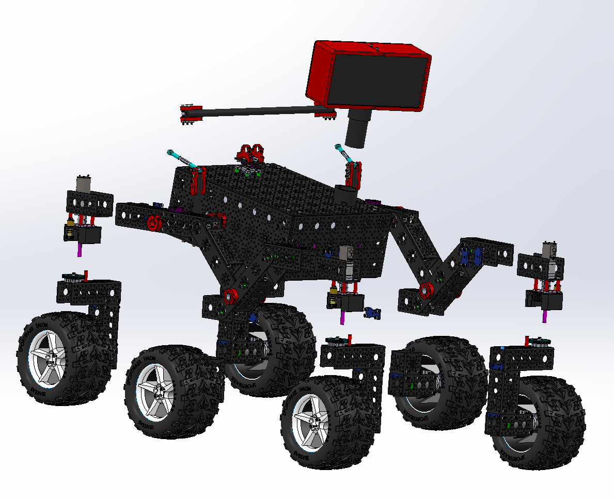

# Mechanical Integration Assembly Instructions

At this point we have every major sub assembly created and they just need to be attached together to create the rover! In the steps in this document, we will attach all the corner motors and wheels, the rocker-bogie, the differential pivot, and the head.

#  1. Mechanical/Structural Assembly
 
The first step is to attach the wheels and corner-steering assemblies to the rocker-bogie arms. The completed rocker-bogie arms are then mounted to the body and connected to the differential pivot. The final step is to mount the head. 

<table>
<tr>
	<td>
	</td>
	<td></td>
	<td></td>
</tr>
</table>
<table>
<tr>
	<td></td>
	<td></td>
</tr>
</table>

**Figure 1: All subassemblies completed**

**Table 1: Parts/Tools Necessary**
 
| Item | Ref | Qty | Image| Item | Ref | Qty | Image|
|------|-----|-----|------|------|-----|-----|------|
|1.5” Channel|S1| 2||0.5” Nylon Washer|W3|3| 
|Channel Connector Plate|S6|14||#6-32x1/4” Button Head Screw|B1|52| 
|0.5” x 15” Aluminum Tube (Modified)|S16A|1||Allen Key Set|D2||
|0.5” x 2” Aluminum Tube|S19|1||Wrench Set|D1||
|0.5” Collar Clamp|S22|7|

## 1.1 Mounting Wheels

### 1.1.1 Mounting the Middle Wheel 
Mount one base wheel (not the corner wheels) to the lowest arm of each of the two rocker bogie subassemblies using a 1.5 inch channel **S1** and channel connectors S6. See Figures 2 and 3. Note that you should mirror the wheels so that they are both on the ”outside” of the rocker bogey subassemblies.
 

 
**Figure 2: Mounting the middle wheel**
 
 
  
  
  **Figure 3: Attaching the middle wheels**

## 1.2 Attaching Corner Steering Assemblies

### 1.2.1 Attach Corner Steering Assembly
Attach one of your corner steering assemblies to the rocker bogie assembly using channel connectors **S6** and screws **B1** as shown in Figure 4. Make sure that you pick a corner steering assembly that has the encoder facing outwards (on the same side as the middle wheel from the previous step).
 
<table>
<tr>
	<td></td>
	<td></td>
</tr>
</table>
 
**Figure 4: Attaching the corner steering assembly**

### 1.2.2 Attach Remaining Assemblies
Repeat the steps above to mount the remaining corner steering assemblies to the other rocker bogie
   
## 1.3 Attaching Corner Wheels

<table>
<tr>
	<td></td>
	<td></td>
</tr>
</table>

**Figure 5: All corner steering assemblies attached**

Attach the four corner wheel assemblies to the corner steering assemblies. They are all symmetric. You may need to spin the encoder gears to mesh with the motor shaft gears if they are not aligned initially. See Figure 6
assembly, again making sure to select the encoder mounts such that the encoders wind up on the outside of the rover.

<table>
<tr>
	<td></td>
	<td></td>
</tr>
</table>

**Figure 6: Attaching the wheels**
 

## 1.4 Mounting Body to Rocker-Bogie

### 1.4.1 Attach Rocker-Bogie Legs to Body
Mount the main body of the rover to the two separate rocker-bogie legs using 15 inch aluminum rod S16A and collar clamps **S22** as shown in Figure 7. Make sure to maintain the order of the collar clamps shown in Figure 7 to fully lock all assemblies along the rod. The rod will go through the pillow blocks on each rocker-bogie leg, and it should pass through the 4th from the back and 2nd up hole on the body as shown in Figure 7.

<table>
<tr>
	<td></td>
	<td></td>
</tr>
</table>

**Figure 7: Mounting Body to Rocker-Bogie**

## 1.5 Attach the Differential Pivot

**Table 2: Parts/Tools Necessar**y

|Item |Ref |Qty |Image|
|-----|----|----|-----|
|0.5” Hollow aluminum tube 2” long|S18|1||
|0.5” Collar clamp|S22|1| |
|0.5” Nylon Washer |W3 |5| 

### 1.5.1 Mounting the differential pivot center
Mount a collar clamp **S22** onto the end of the 2” Aluminum Rod **S18** as well as two of the 0.5” Nylon washers **W3** as shown in Figure 8. Then, insert this rod into the pillow bearing blocks from the inside of the body assembly. Add three more nylon washers on the outside / top and then attach the clamping assembly on the middle of the differential pivot (see Figure 8).

<table>
<tr>
	<td></td>
	<td></td>
</tr>
</table>

**Figure 8: Inserting differential pivot joint**

   
### 1.5.2 Attaching the differential pivot arms
Attach the the bottom sections of the differential pivot to the 0.5 inch clamping hubs on each of the Rocker-Bogie attachments. Once these are all in place, tighten down each of the screws on all of the clamping hubs as shown in Figure 9.

**Figure 9: Attaching the differential pivot**

## 1.6 Mounting the Head

### 1.6.1 Mounting the head to the body 
Slide the PVC pipe at the bottom of the head into the PVC clamping hub on the rover body and tighten down the clamping screws.

<table>
<tr>
	<td></td>
	<td></td>
</tr>
</table>

**Figure 10: Attaching the head**

### 1.6.2 Checkpoint
You rover should now be fully assembled! Verify that your rover looks like the rover in Figure 11.

**Figure 11: Final Mechanical Rover**

